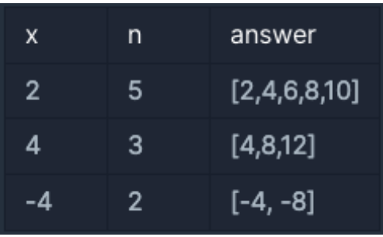

## 1번 문제 : x만큼 간격이 있는 n개의 숫자

### 문제 설명

함수 solution은 정수 x와 자연수 n을 입력 받아, x부터 시작해 x씩 증가하는 숫자를 n개 지니는 리스트를 리턴해야 합니다.

다음 제한 조건을 보고, 조건을 만족하는 함수, solution을 완성해주세요.

### 제한 조건

- x는 -10000000 이상, 10000000 이하인 정수입니다.
- n은 1000 이하인 자연수입니다.

### 입출력 예

### 문제풀이

1. x 부터 x만큼 증가하는 길이가 n인 리스트(배열)을 만들어야 한다.
2. 길이만큼 반복문을 실행시켜 x만큼 증가시킨다.
